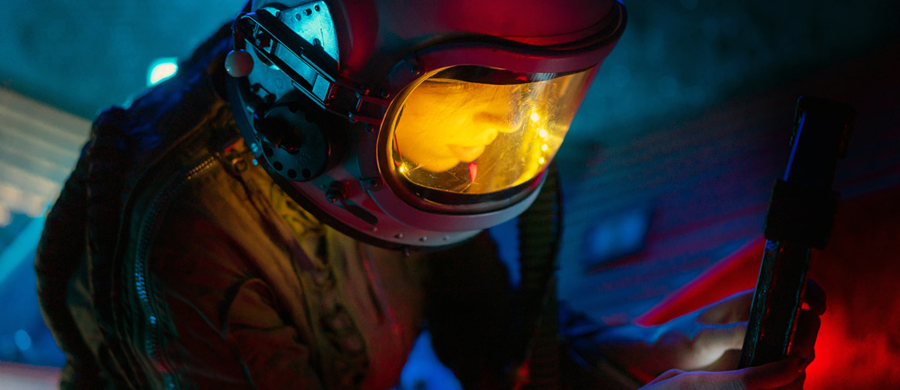

<!--- adjust font size for headers and body --->

<style>
.main-container {
  max-width: 2000px !important;
  margin-left: auto;
  margin-right: auto;
}
h1.title {
  font-size: 56px;
  font-style: bold
}
h1 {
  font-size: 36px;
}
h4.author {
  font-size: 38px;
}
h4.date {
  font-size: 38px;
}
body {
  font-size: 18px;
}
</style>

<br>

# What Technology do we Need?

```{r nuclearSpacecraftImg, echo=FALSE, out.width=1600}

```

&emsp;&emsp;&emsp; One of the major hurdles in getting humans to Mars is the spacecraft technology that we need to develop. Systems ranging from propulsion, to avionics, to power generation need to be conceived and improved upon in order to make it possible to get to the red planet. For propulsion, one technology that is currently being worked on and looks promising is nuclear propulsion. Using a nuclear reactor, they push gaseous particles, such as xenon or krypton ions out of a thruster, which propels the spacecraft forward.<sup><a href='https://www.nasa.gov/directorates/spacetech/nuclear-propulsion-could-help-get-humans-to-mars-faster' target='_blank'>[1]</a></sup> These engines would produce less thrust than conventional engines, but would require very little energy and have a long burn time due to their low fuel requirement and high efficiency. This makes them an appealing choice for a crewed mission. <br>
&emsp;&emsp;&emsp; As for power generation, the two choices that are most likely are solar and nuclear. Due to Mars being farther away from the Sun than Earth, solar energy is weaker, making solar panels less effective. A solution that has been used in the past for space missions, but will need improvement, is nuclear energy. In space, this often comes in the form of radioisotope thermoelectric generators (RTG). This special type of nuclear reactor converts heat from decaying material (usually plutonium) into electricity.<sup><a href='https://mars.nasa.gov/internal_resources/788/' target='_blank'>[2]</a></sup> An RTG has several advantages over solar power generation, including greater reliability and consistent power output. However, it also comes with some drawbacks such as the dangers of radiation. <br>
&emsp;&emsp;&emsp; These technologies still need quite a bit of work and are not the only options for a crewed mission to Mars, with others being researched, developed and considered.

<br>

# What do we Need to Bring?

```{r marsAstronautImg, echo=FALSE, out.width=1600}

```

&emsp;&emsp;&emsp; One of the greatest challenges that will come with a Mars mission is the amount of cargo that will need to be transported to the planet. The likely cargo requirements of a crewed mission to Mars are outlined below. <br>
&emsp;&emsp;&emsp; The most essential cargo for the mission would undoubtedly be water, oxygen and food for the crew. Thanks to recycling systems tested on the International Space Station (ISS), water, and to an extent, oxygen could be efficiently recycled throughout the mission duration, cutting down on the water and oxygen requirements for the mission. Using the ISS as a benchmark for consumption of these resources, it can be estimated that an astronaut uses 2.5 metric tons of water, 0.8 metric tons of oxygen and 1.5 metric tons of food per year.<sup><a href='https://www.nasa.gov/vision/earth/everydaylife/jamestown-needs-fs.html' target='_blank'>[3]</a></sup> Assuming an opposition class, or short stay mission to Mars, and a crew size of 6, we can estimate that the crew would require about 25 metric tons of water, 8 metric tons of oxygen and 15 metric tons of food. A longer mission would require far more of each of these resources. The mission's success would also hinge on the assumption that none of the recycling systems fail. <br>
&emsp;&emsp;&emsp; Another major cargo requirement the mission would have to account for is fuel. NASA’s current estimate for the fuel requirement of a mission to Mars with four to six astronauts is approximately 540 metric tons.<sup>[4]</sup> This figure includes the fuel for the return journey to Earth. Many of the current mission proposals, including those of Robert Zubrin, found in his book, <em>The Case of Mars</em>, involve the return module landing on the surface of Mars prior to the astronauts’ arrival.<sup>[5]</sup> Zubrin proposes landing a return module on the surface of Mars years in advance along with nuclear reactors and allowing the module to generate its own, composed of liquid oxygen and hydrogen, using the molecules in Mars’ atmosphere. This proposal would drastically cut down on the cargo requirement for the mission, however, it would also involve the use of a complex series of advanced nuclear reactors for electricity that are currently unproven and unreliable. <br>
&emsp;&emsp;&emsp; Finally, the mission would also require the transport of other cargo, such as entertainment for the crew, crew exercise machines, clothing, a radiation shelter, scientific instruments and many other miscellaneous items that would further add to the cargo requirements of the mission. The weight requirements of even a short stay Mars mission would be immense and would undoubtedly require NASA to innovate space travel in an unprecedented number of ways.

<br>

# What About the Surface Temperature?

```{r marsSurfaceImg, echo=FALSE, out.width=1600}

```

&emsp;&emsp;&emsp; A primary concern for sending a manned mission to Mars will be how we choose to address the fact that Mars is a cold, radioactive desert with no breathable air. Fortunately, these challenges are quite easy to overcome in the short term, as most of our solutions lie in the design of the spacesuits and habitats that astronauts would be using. <br>
&emsp;&emsp;&emsp; Spacesuits, by merit of their design, already address the problem of atmosphere. The astronauts would be in an enclosed system that would be pressurized and supply them with the oxygen needed to survive. The spacesuits the astronauts would wear would have some sort of thermal undergarment, just like the spacesuits used during the Apollo and STS missions. This thermal undergarment system would regulate the body temperature of whoever is wearing the spacesuit, protecting them from the frigid temperatures of Mars, as well as the possibility of overheating from exertion or exposure to the sun.<sup><a href='https://thermajohn.com/blogs/news/do-astronauts-wear-thermal-underwear' target='_blank'>[6]</a></sup> These spacesuits would also likely have some sort of protective layer that would shield the astronauts from heightened levels of UV radiation due to the lack of a magnetosphere on Mars. While such protective systems may be cumbersome, especially radiologically-protective materials such as lead, this may not be a concern due to the lower gravity on Mars compared to Earth. Despite seemingly no sacrifice in terms of mobility and dexterity made by the astronaut, these design considerations will still likely point towards a more massive spacesuit and add on to the proverbial mass "bill" when it comes to launching a spacecraft full of mission equipment and supplies from Earth and through space. This becomes more evident when one remembers that the same radiation-shielding material used in the spacesuits will also be needed for habitats as well. <br>
&emsp;&emsp;&emsp; According to NASA Standard 3001 Volume 1, astronauts have a radiation exposure limit of 600 milliSieverts (mSv) over the course of their career.<sup><a href='https://standards.nasa.gov/standard/nasa/nasa-std-3001-vol-1' target='_blank'>[7]</a></sup> Without any protection, the crew of a mission to Mars would be exposed to about 1000 mSv on a Hohmann transfer, and then another 100 mSv for every year they stay on Mars, meaning the crew would receive a career-ending (but not life-ending) dosage of radiation before they would even reach Mars.<sup><a href='https://www.lehman.edu/academics/education/middle-high-school-education/documents/mars.pdf' target='_blank'>[8]</a></sup> In order to reduce the chance of developing cancer or acute radiation poisoning, we would want to develop some sort of protective layer for the Martian habitats, where astronauts would spend most of their time. The habitats could have layers of protective material, be subterranean so that the Martian soil could block a majority of radiation from the sun or some combination of both. These habitats would also be temperature-controlled, likely by some sort of heating unit. Due to Mars’ distance from the sun and its thin atmosphere, a mission to Mars would likely need to rely on nuclear power. The heat generated from a nuclear energy generation, either with an RTG or a fission reactor, could be used to heat water which could be circulated around the habitats in strategically positioned pipes and radiators could use the water to heat the air inside. <br>
&emsp;&emsp;&emsp; As facilities on Mars become more established and humanity starts to think about more permanent colonizing efforts, addressing the same atmospheric and radiological challenges becomes much more difficult. If we wanted to make the atmosphere breathable without any assistance from a spacesuit, we would need to make the Martian atmosphere more similar to that of Earth. Fortunately, much of Mars’ oxygen is trapped in rocks in the form of iron oxides. We cannot stop only at oxygen though, as the atmosphere would be highly flammable and much too thin. We would also need to populate the atmosphere with nitrogen, which Mars does not have much of. An additional need would be to warm up the surface Mars to livable temperatures for humans, which would prove to be a massive challenge as well. We could add more greenhouse gasses to the atmosphere, but Mars's atmosphere already consists mostly of CO<sub>2</sub>, which might be better for photosynthetic life, but definitely not for respiratory life, namely humans. We could do what Elon Musk suggests and detonate thousands of nuclear warheads at the poles to simulate the heat of the sun, but this could make Mars even more radioactive.<sup><a href='https://www.latimes.com/business/la-fi-elon-musk-mars-20150910-htmlstory.html' target='_blank'>[9]</a></sup> If we were to make the Martian atmosphere more hospitable, we would also need a way to work around Mars’ lack of a magnetosphere, without which our newly manufactured atmosphere would disappear at the hands of solar winds. NASA has proposed putting some sort of magnetic shield at the L1 Lagrange Point of Mars that could induce a magnetic field and deflect any radiation coming from the sun.<sup><a href='https://phys.org/news/2017-03-nasa-magnetic-shield-mars-atmosphere.html' target='_blank'>[10]</a></sup> The process of terraforming Mars to be permanently habitable will be the largest, most challenging and most expensive geoengineering challenge to humanity yet and will likely take generations to complete.

<br>

# How will we Communicate with the Crew?

```{r marsCommunicationImg, echo=FALSE, out.width=1600}

```

&emsp;&emsp;&emsp; After the spacecraft leaves Earth for a mission, it is necessary to maintain a connection with the astronauts inside to ensure a safe and functional mission. However, there are several challenges to consider, particularly the long distance between Earth and Mars. <br>
&emsp;&emsp;&emsp; One of the biggest challenges we face in keeping astronauts on Mars in touch with Earth is the significant time delay in communication due to the distance between the two planets. Depending on the positions of Earth and Mars in their respective orbits, the time delay in communication can range from several minutes to as much as 20 minutes. Such a delay could be problematic in situations where quick responses are critical, potentially putting the astronauts' safety at risk. <br>
&emsp;&emsp;&emsp; Solar wind can also be a challenge for communication system operation. Solar storms, unlike storms on Earth, release high-energy particles and intense bursts of radiation, causing a disturbance in the magnetic field that can lead to disruptions in most power grids and communication networks. This can lead to significant delays or even damage to facilities. <br>
&emsp;&emsp;&emsp; The system that NASA uses to communicate with spacecraft beyond Earth's orbit is The Deep Space Network (DSN). The DSN is a vital part of NASA's deep space exploration program and enables the agency to communicate with and receive data from spacecraft exploring the solar system, including Mars, Jupiter, Saturn, and beyond. With three primary ground stations located in California, Spain, and Australia, strategically positioned around the globe to ensure continuous communication coverage and huge antennas in each, the system makes it possible for humans to transmit and receive data over vast distances and control the operation of spacecraft far away. <br>
&emsp;&emsp;&emsp; After sending humans on a mission to Mars, the necessity of keeping the spacecraft in touch and maintaining communication becomes even more critical to ensure the safety of the astronauts. To do so, the system to use may still be the DSN system since it has already proven to have the ability to send signals in space in a relatively stable way. According to NASA, the antennas are currently extremely busy trying to track all of these space missions at once. Although there is a sophisticated system to keep that working, the mission to Mars requires much more information and processing and thus requires a larger capability in the DSN system.

<br>

# Resources

&nbsp;&nbsp;[1]&emsp;<a href='https://www.nasa.gov/directorates/spacetech/nuclear-propulsion-could-help-get-humans-to-mars-faster' target='_blank'>Nuclear Propulsion</a>

&nbsp;&nbsp;[2]&emsp;<a href='https://mars.nasa.gov/internal_resources/788/' target='_blank'>Radioisotope Thermoelectric Generators</a>

&nbsp;&nbsp;[3]&emsp;<a href='https://www.nasa.gov/vision/earth/everydaylife/jamestown-needs-fs.html' target='_blank'>Sustaining Human Life During Exploration</a>

&nbsp;&nbsp;[4]&emsp;NASA, Human Exploration of Mars Design Reference Architecture 5.0

&nbsp;&nbsp;[5]&emsp;Robert Zubrin, <em>The Case for Mars</em>

&nbsp;&nbsp;[6]&emsp;<a href='https://thermajohn.com/blogs/news/do-astronauts-wear-thermal-underwear' target='_blank'>Do Astronauts Wear Thermal Underwear?</a>

&nbsp;&nbsp;[7]&emsp;<a href='https://standards.nasa.gov/standard/nasa/nasa-std-3001-vol-1' target='_blank'>NASA Space Flight Human-System Standard Volume 1</a>

&nbsp;&nbsp;[8]&emsp;<a href='https://www.lehman.edu/academics/education/middle-high-school-education/documents/mars.pdf' target='_blank'>Health Threat From Cosmic Radiation During Manned Missions</a>

&nbsp;&nbsp;[9]&emsp;<a href='https://www.latimes.com/business/la-fi-elon-musk-mars-20150910-htmlstory.html' target='_blank'>What Scientists Say About Elon Musk's Idea to Nuke Mars</a>

[10]&emsp;<a href='https://phys.org/news/2017-03-nasa-magnetic-shield-mars-atmosphere.html' target='_blank'>NASA Proposes a Magnetic Shield to Protect Mars' Atmosphere</a>

<br>

Last updated: 2023-05-01 19:44:48 EDT